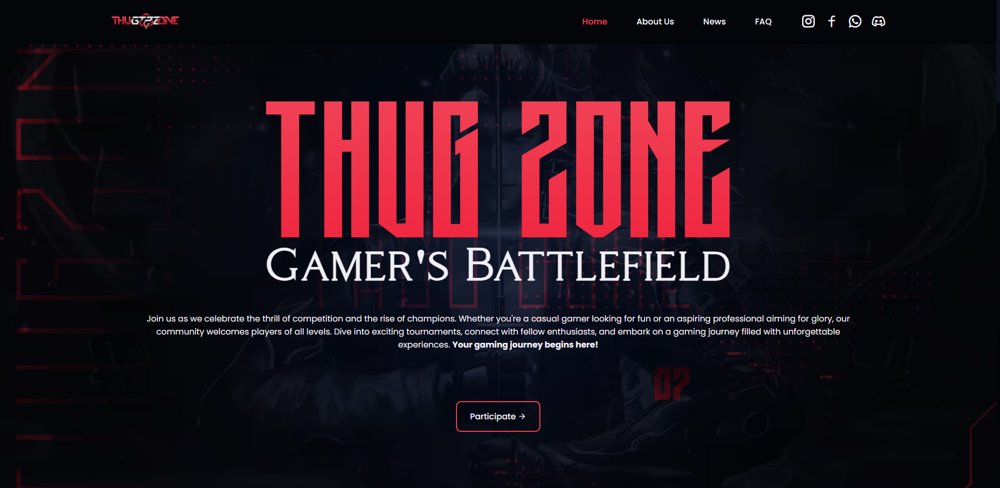
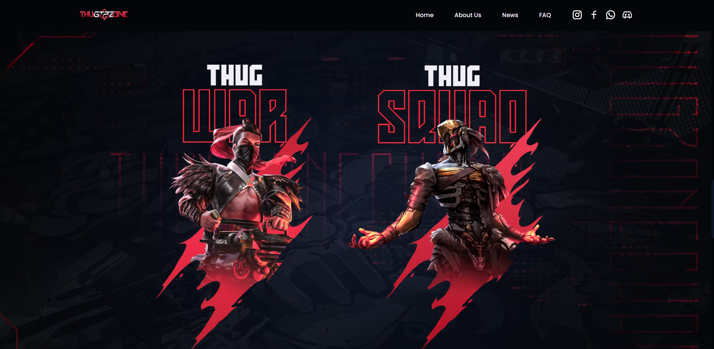

# 🎮 Thug Zone – Gaming Startup Website

A modern, high-performance gaming platform website built for **Thug Zone**, a Free Fire-focused startup. Developed during a freelance collaboration, this project blends clean design, smooth user interactions, and dynamic data handling — all without a traditional backend.

## 🌐 Live Website  
[🔗 Visit Now](https://thugzone.in)

---

## 🧩 Overview

This project was developed as part of a freelance collaboration with the Thug Zone team to establish their online identity and handle player participation for Free Fire tournaments. The goal was to create a responsive, interactive, and easily manageable website — powered entirely by frontend technologies.

> ✅ Built with **HTML**, **CSS**, **JavaScript**, **GSAP**, and **Google Sheets** as a lightweight backend alternative.

> 🚧 This is an ongoing project. Future upgrades will include React, Next.js, Framer Motion, and possibly a full MERN stack for dynamic data features.

---

## ✨ Key Features

- 🎮 **Modern UI Design** tailored for gaming startups  
- ⚡ **Smooth GSAP Animations** using ScrollTrigger for scroll-based effects  
- 📋 **Dynamic Google Sheets Form Integration** for player role submissions  
- 📱 **Fully Responsive** and optimized for all screen sizes  
- 🎯 **User-Centric UX** with intuitive layout and interactions  
- 🌐 **Hosted with Hostinger**, Domain from GoDaddy  
- 🛠️ **Easily Maintainable** – built with static assets and spreadsheet-based backend  

---

## 📸 Screenshots

### 🏠 Homepage

### 🧙 Hover-Based Animation

### 🎞️ Scroll-Based Animation

---

## 🛠️ Tech Stack

- **HTML5**  
- **CSS3**  
- **JavaScript (ES6+)**  
- [`GSAP`](https://greensock.com/gsap/) – Advanced animations  
- [`ScrollTrigger`](https://greensock.com/scrolltrigger/) – Scroll-based triggers  
- [`Google Apps Script`](https://developers.google.com/apps-script) – For Google Sheets form integration  
- **Hostinger** – Hosting  
- **GoDaddy** – Domain provider  

---

## 📈 Project Status & Roadmap

- ✅ Initial layout and visual design completed  
- ✅ GSAP animations and scroll effects added  
- ✅ Player role submission form with Google Sheets  
- ✅ Mobile-friendly responsive design  

### 🔮 Planned Future Enhancements:
- [ ] Add real-time tournament stats and countdowns  
- [ ] Create admin panel using MongoDB  
- [ ] Migrate to **React** and **Next.js**  
- [ ] Integrate **Framer Motion** for next-level animations  
- [ ] Implement MERN stack (MongoDB, Express, React, Node.js) for full-stack features  

> ⚡ This is an evolving project — it will continue to grow as I learn and implement modern technologies.

---

## 👨‍💻 Developer Info

**Vimal Verma**  
_Web Developer & Freelancer_  
📍 Remote / Delhi, India  
🗓️ Nov 2024 – Present  

> "This freelance project helped me sharpen real-world development skills — from planning and animation to hosting, deployment, and backend-less data handling."

---

## 🤝 Collaboration & Credits

- Project designed and developed by [**Vimal Verma**](https://github.com/vimalvdev)  
- Built in collaboration with the **Thug Zone Gaming Team**  
- Hosting by **Hostinger**, domain by **GoDaddy**

---

## 📬 Contact

Got questions or want to work together?

- Email [vimalverma8287@gmail.com](mailto:vimalverma8287@gmail.com)  
- Linkden [LinkedIn](https://www.linkedin.com/in/vimalvermadev/)  
- Twitter/X [X](https://x.com/VimalvDeveloper)  

---
